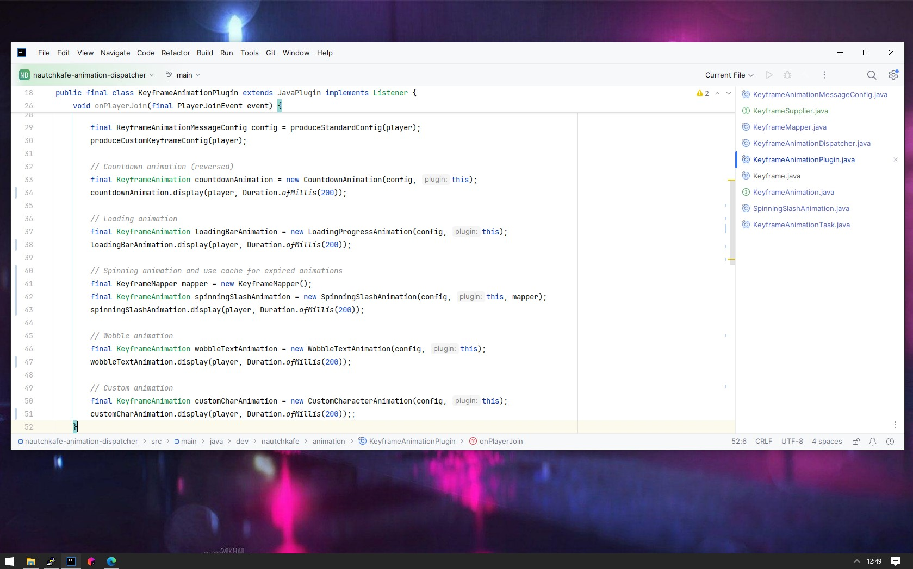
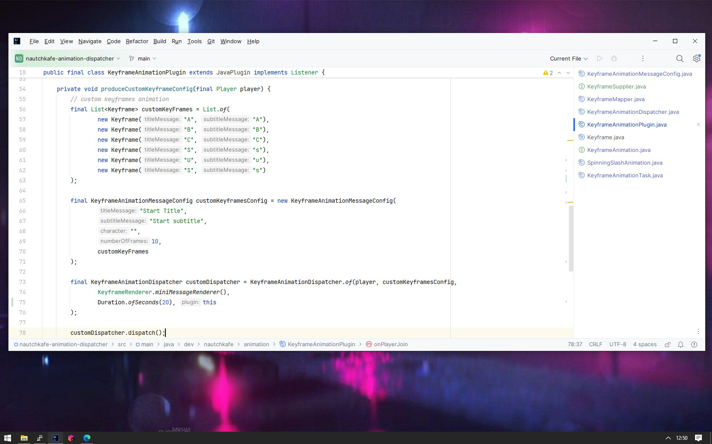
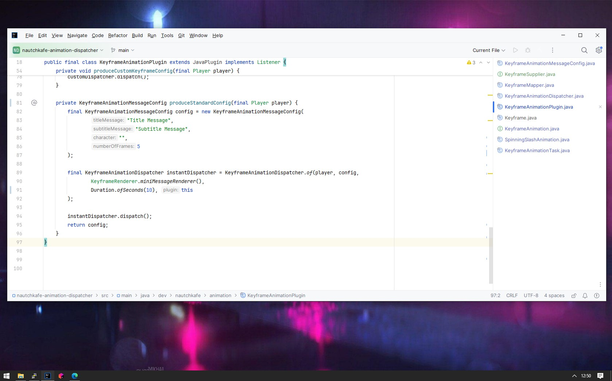

# -> Keyframe animation dispatcher <-


# Overview of the API Facade Usage:
### Configuration Before Sending and Executing Animations to use the animation API you must first configure the keyframes before sending and executing them.

```java
KeyframeAnimationMessageConfig config = new KeyframeAnimationMessageConfig(
    titleMessage = "Your Title Message",
    subtitleMessage = "Your Subtitle Message",
    character = "", // Optionally, specify a character for animation
    numberOfFrames = 5 // Specify the number of frames to operate on
);
```

# Example
<p align="center">
  
  
  
</p>

```java
Player player = event.getPlayer();
KeyframeAnimationMessageConfig config = new KeyframeAnimationMessageConfig(
        "Title Message", 
        "Subtitle Message", 
        "", 
        5
);
	
// Create and dispatch standard the animation
KeyframeAnimationDispatcher instantDispatcher = KeyframeAnimationDispatcher.of(player, config,
        KeyframeRenderer.miniMessageRenderer(),
        Duration.ofSeconds(10), this
);

        instantDispatcher.dispatch();
```

```java
// Create custom keyframes animation
List<Keyframe> customKeyFrames = List.of(
        new Keyframe("S", "s"),
        new Keyframe("U", "u"),
        new Keyframe("S", "s")
);

KeyframeAnimationMessageConfig customKeyframesConfig = new KeyframeAnimationMessageConfig(
        "Start Title",
        "Start subtitle",
        "",
        10,
        customKeyFrames
);

KeyframeAnimationDispatcher customDispatcher = KeyframeAnimationDispatcher.of(player, customKeyframesConfig,
        KeyframeRenderer.miniMessageRenderer(),
        Duration.ofSeconds(20), this
);

        customDispatcher.dispatch();
```

# Additional Implementations
### In addition to the primary implementation, several example animations have also been provided, such as:

- [Countdown Animation](https://github.com/noyzys/nautchkafe-animation-dispatcher/blob/main/src/main/java/dev/nautchkafe/animation/impl/CountdownAnimation.java)
- [Custom Character Animation](https://github.com/noyzys/nautchkafe-animation-dispatcher/blob/main/src/main/java/dev/nautchkafe/animation/impl/CustomCharacterAnimation.java)
- [Loading Progress Animation](https://github.com/noyzys/nautchkafe-animation-dispatcher/blob/main/src/main/java/dev/nautchkafe/animation/impl/LoadingProgressAnimation.java)
- [Spinning Slash Animation](https://github.com/noyzys/nautchkafe-animation-dispatcher/blob/main/src/main/java/dev/nautchkafe/animation/impl/SpinningSlashAnimation.java)
- [Wobble Text Animation](https://github.com/noyzys/nautchkafe-animation-dispatcher/blob/main/src/main/java/dev/nautchkafe/animation/impl/WobbleTextAnimation.java)

**If you are interested in exploring functional programming and its applications within this project visit the repository at [vavr-in-action](github.com/noyzys/bukkit-vavr-in-action), [fp-practice](github.com/noyzys/fp-practice).**
